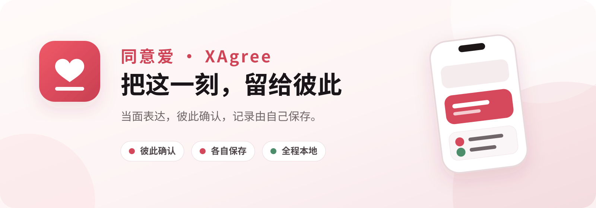
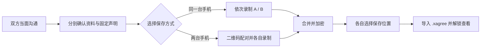

<p align="center">
  <strong>简体中文</strong> · <a href="./README_EN.md">English</a> · <a href="./README_JA.md">日本語</a>
</p>

<p align="center">
  
</p>

<p align="center">
  
  
  
  
</p>

<p align="center">
  <strong>同意爱（XAgree）</strong>是一款面向成年伴侣的本地优先知情表达记录工具。<br>
  无账号、无开发者服务器、无广告与追踪；双方亲自参与，记录由自己保存。
</p>

<p align="center">
  简体中文 · English · 日本語
</p>

> [!IMPORTANT]
> 同意必须是清醒、自愿、明确、持续且随时可以撤回的。任何视频或文件都不能替代当下沟通，也不代表永久同意、身份认证或法律结论。本项目仅适用于已达到法定年龄、能够有效表达意愿且用途合法的参与者。

## 产品一览

<table>
  <tr>
    <td align="center" width="29%">
      <br>
      <sub>中文首页 · 两种记录方式</sub>
    </td>
    <td align="center" width="29%">
      <br>
      <sub>English · 完整本地化</sub>
    </td>
    <td align="center" width="42%">
      <br>
      <sub>iPad · 自适应大屏布局</sub>
    </td>
  </tr>
</table>

## 为什么是同意爱

同意爱把重点放在「一起把边界说清楚」，而不是给任何人制造证明压力。每位参与者都需要亲自确认资料、阅读固定声明并开始自己的录制；完成后的内容以加密文件保存到双方自己选择的位置。

| 产品能力 | 体验 |
| --- | --- |
| **两台手机，各自保存** | 扫描二维码建立附近设备加密连接；双方各自录制、各自加密、各自保存。 |
| **一台手机，轮流完成** | 两位参与者依次录制，最终按照 A → B 合成为一份记录。 |
| **私密空间** | 使用本地密码保护个人资料和待导出内容；密码不会发送给开发者。 |
| **加密文件** | 导出版本化 `.xagree` 文件，必须通过本 App 和对应密码才能解锁播放。 |
| **清晰的录制状态** | 3 秒准备倒计时、明显的 `REC` 状态、最长 30 秒、画面内烧录时间与会话信息。 |
| **多语言与多设备** | 支持简体中文、英语、日语，以及 iPhone 与 iPad。 |

## 使用流程



1. **建立私密空间**
   设置至少 8 位的本地密码，可选填写提示词；姓名与头像只保存在本机加密配置中。

2. **选择记录方式**
   可以在同一台设备上轮流完成，也可以通过附近两台设备各自完成。

3. **每个人亲自参与**
   双方分别核对资料与声明，并亲自点击开始；App 不提供静默、后台或远程启动录制。

4. **合成、加密、导出**
   两段记录按固定顺序合成后写入 `.xagree` 加密包，再通过系统“文件”界面保存到用户选择的位置。

5. **需要时解锁查看**
   从“文件”导入加密包并输入密码。临时播放文件会在退出播放、锁屏、切到后台或超时后清理。

## 隐私设计

- **不要求账号**：没有注册、登录、手机号或邮箱流程。
- **没有开发者云端**：App 不连接开发者服务器；双机模式仅使用附近设备连接。
- **不做行为追踪**：无广告、分析、崩溃上报或第三方统计 SDK。
- **保存位置由用户决定**：App 使用系统文件选择器导出；选择 iCloud Drive 时，文件交由 Apple iCloud 保存，而不是上传给开发者。
- **不写入系统相册**：原始片段和合成明文不作为普通视频保存到照片库。
- **后台立即遮蔽**：进入后台时显示隐私遮罩，并清理用于播放的临时明文。
- **最小权限**：仅在对应流程需要时请求相机、麦克风和本地网络权限。

项目内置的 Privacy Manifest 声明不收集数据、不追踪用户，也不配置追踪域名。

## 安全实现

| 环节 | 当前实现 |
| --- | --- |
| 文件内容加密 | 随机 256-bit 内容密钥；视频按 1 MiB 分块使用 AES-256-GCM 加密。 |
| 密码派生 | PBKDF2-HMAC-SHA512、每文件随机盐和设备校准后的迭代次数。 |
| 双机密钥协商 | 临时 X25519（Curve25519 Key Agreement）+ HKDF，并显示六位短验证码供双方核对。 |
| 传输保护 | `MCSession` 强制加密，片段再次使用会话密钥分块加密。 |
| 完整性检查 | AES-GCM 认证标签、唯一 nonce 检查与 SHA-256 文件哈希。 |
| 本地文件保护 | 工作文件使用 `NSFileProtectionComplete`，并排除系统备份。 |

安全设计与实现仍应接受独立审计。请不要把“使用了现代密码学算法”等同于“已经通过安全认证”。

## 技术栈

- **界面与状态**：SwiftUI、Observation
- **音视频**：AVFoundation、AVAssetWriter、AVMutableComposition
- **密码学**：CryptoKit、CommonCrypto、Security
- **附近设备**：MultipeerConnectivity、Core Image 二维码
- **文件与图片**：UniformTypeIdentifiers、PhotosUI、系统文件选择器
- **工程配置**：Swift 6 语言模式，iOS 17.0+，iPhone / iPad
- **第三方依赖**：无

## 本地构建

### 环境

- macOS
- Xcode 26.6（当前开发环境）
- Swift 6.3.3（工程使用 Swift 6 语言模式）
- iOS 17.0 或更高版本的模拟器 / 真机

### 运行

```bash
git clone https://github.com/han-ziyi/agree.git
cd agree
open "性同意.xcodeproj"
```

在 Xcode 中选择 `性同意` Scheme 和一个 iPhone / iPad 目标后运行。

也可以从命令行构建：

```bash
xcodebuild \
  -project "性同意.xcodeproj" \
  -scheme "性同意" \
  -sdk iphonesimulator \
  CODE_SIGNING_ALLOWED=NO \
  build
```

### 测试

仓库包含加密单元测试与关键引导流程 UI 测试：

```bash
xcodebuild \
  -project "性同意.xcodeproj" \
  -scheme "性同意" \
  -destination "platform=iOS Simulator,name=iPhone 16 Pro" \
  test
```

## 项目结构

```text
.
├── 性同意/                     # App 源码与资源
│   ├── AppRootView.swift       # 引导、首页与隐私界面
│   ├── CaptureService.swift    # 录制与实时水印
│   ├── EvidenceCrypto.swift    # .xagree 容器加解密
│   ├── PeerSessionCoordinator.swift
│   └── Localizable.xcstrings   # 中 / 英 / 日文案
├── XAgreeTests/                # 单元测试
├── XAgreeUITests/              # UI 测试
├── docs/assets/                # README 产品视觉
└── APP_PLAN.md                 # 产品与安全设计说明
```

## 当前状态

项目处于本地开发与真机验证阶段，尚未作为正式 App Store 版本发布。发布前仍需要：

- 两台真机的完整双机流程验证
- 独立安全审查与隐私检查
- 适用地区的法律审查
- App Store 审核预评估

## 使用边界

- 本 App 不验证参与者身份、年龄或表达内容的真实性。
- 水印中的本地时间不是可信司法时间戳。
- 记录不能证明同意持续存在，也不能限制任何人随后撤回同意。
- iOS 闪存不提供可验证的安全擦除保证，因此项目不承诺“彻底物理删除”。
- 如果任何一方不确定、不舒服、受到压力、无法清晰表达或已经撤回，请立即停止。

---

<p align="center">
  <br>
  <strong>把边界说清楚，把记录留在自己手里。</strong>
</p>
