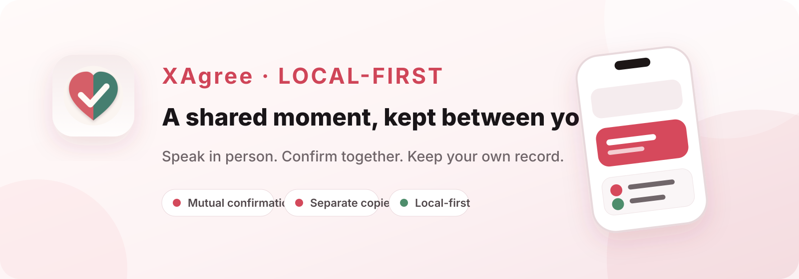
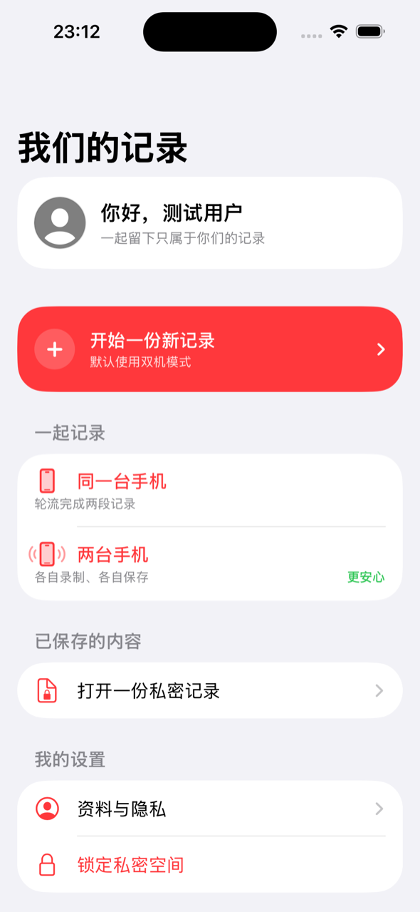
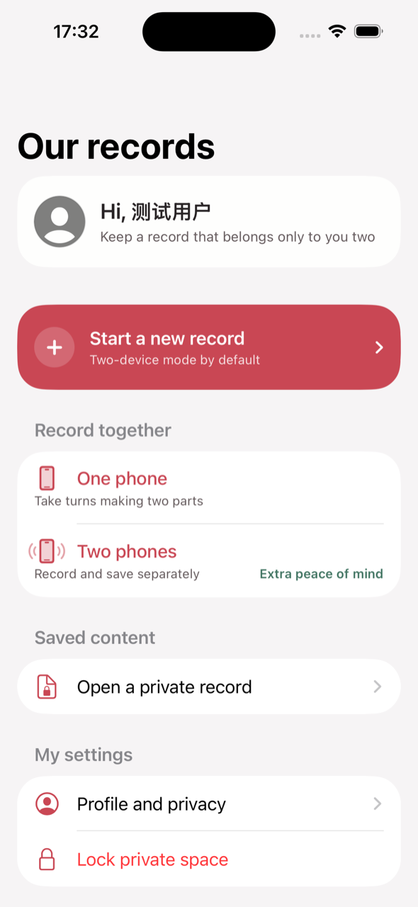
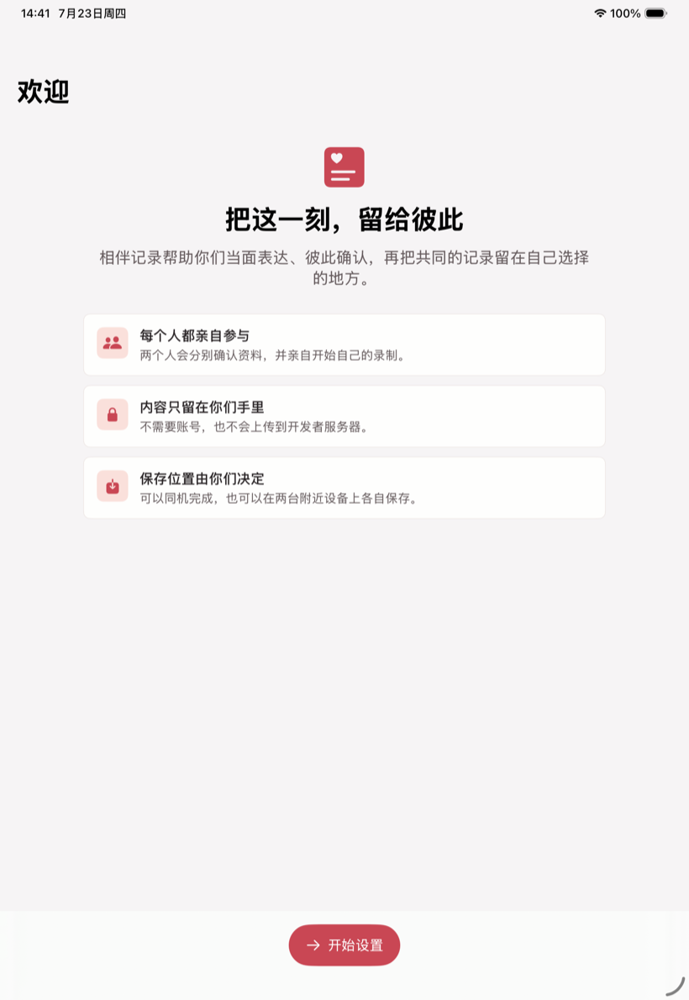
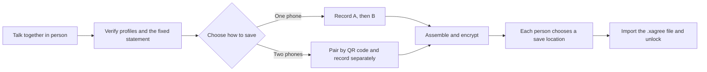
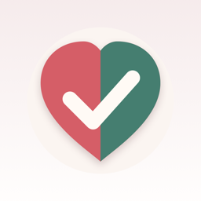

<p align="center">
  <a href="./README.md">简体中文</a> · <strong>English</strong> · <a href="./README_JA.md">日本語</a>
</p>

<p align="center">
  
</p>

<p align="center">
  
  
  
  
</p>

<p align="center">
  <strong>XAgree</strong> is a local-first informed-expression record app for adult partners.<br>
  No account, no developer-operated server, no ads or tracking. Everyone participates in person and keeps their own record.
</p>

<p align="center">
  简体中文 · English · 日本語
</p>

> [!IMPORTANT]
> Consent must be conscious, voluntary, explicit, ongoing, and revocable at any time. No video or file can replace communication in the moment, and no record represents permanent consent, identity verification, or a legal conclusion. This project is only for participants who have reached the legal age, can express their wishes freely, and are acting lawfully.

## Product at a glance

<table>
  <tr>
    <td align="center" width="29%">
      <br>
      <sub>Simplified Chinese · two recording modes</sub>
    </td>
    <td align="center" width="29%">
      <br>
      <sub>English · fully localized UI</sub>
    </td>
    <td align="center" width="42%">
      <br>
      <sub>iPad · adaptive large-screen layout</sub>
    </td>
  </tr>
</table>

## Why XAgree

XAgree is designed to help two people clarify boundaries together, not to pressure anyone into creating proof. Each participant must personally verify the displayed information, read the fixed statement, and start their own recording. The result is encrypted and saved only to a location chosen by the participants.

| Capability | Experience |
| --- | --- |
| **Two phones, separate copies** | Scan a QR code to create an encrypted nearby connection. Each participant records, encrypts, and saves independently. |
| **One phone, two turns** | The participants record one after the other; the final record is assembled in A → B order. |
| **Private space** | A local password protects profile data and pending exports. The password is never sent to the developer. |
| **Encrypted package** | The app exports a versioned `.xagree` file that requires this app and the matching password to unlock. |
| **Clear recording state** | A 3-second countdown, prominent `REC` indicator, 30-second maximum, and a burned-in local time/session watermark. |
| **Localized and adaptive** | Simplified Chinese, English, and Japanese on both iPhone and iPad. |

## How it works



1. **Create a private space**
   Set a local password of at least eight characters and optionally add a hint. The profile name and avatar remain in encrypted local settings.

2. **Choose a recording mode**
   Take turns on one device, or use two nearby devices so each participant completes and saves their own copy.

3. **Everyone participates personally**
   Each person verifies the information and statement, then taps Start themselves. The app provides no silent, background, or remote recording start.

4. **Assemble, encrypt, and export**
   The two segments are combined in a fixed order, sealed into an encrypted `.xagree` package, and exported through the system Files interface.

5. **Unlock only when needed**
   Import the package from Files and enter its password. Temporary playback plaintext is removed after playback ends, the device locks, the app enters the background, or the session times out.

## Privacy by design

- **No account required:** no registration, login, phone number, or email flow.
- **No developer cloud:** the app does not connect to a developer-operated server; two-device mode uses only a nearby-device connection.
- **No behavioral tracking:** no ads, analytics, crash-reporting SDK, or third-party statistics package.
- **You choose the destination:** exports use the system file picker. If you select iCloud Drive, the file is stored by Apple iCloud, not uploaded to the developer.
- **No Photos-library copy:** source segments and assembled plaintext are not saved as ordinary videos in the system photo library.
- **Immediate privacy shielding:** the UI is covered when the app moves to the background, and temporary playback plaintext is cleaned up.
- **Minimum permissions:** camera, microphone, and local-network access are requested only for the relevant flow.

The included Privacy Manifest declares no collected data, no tracking, and no tracking domains.

## Security implementation

| Area | Current implementation |
| --- | --- |
| Package encryption | Random 256-bit content key; video encrypted in 1 MiB chunks with AES-256-GCM. |
| Password derivation | PBKDF2-HMAC-SHA512 with a random per-file salt and device-calibrated iteration count. |
| Two-device key agreement | Ephemeral X25519 (Curve25519 Key Agreement) + HKDF, with a six-digit short code for both participants to compare. |
| Transport protection | `MCSession` requires encryption, and each media segment is additionally chunk-encrypted with the session key. |
| Integrity checks | AES-GCM authentication tags, unique-nonce validation, and SHA-256 file hashes. |
| Local file protection | Working files use `NSFileProtectionComplete` and are excluded from system backups. |

The design and implementation still require independent review. Using modern cryptographic primitives does not mean the app has received a security certification.

## Technology

- **UI and state:** SwiftUI, Observation
- **Audio/video:** AVFoundation, AVAssetWriter, AVMutableComposition
- **Cryptography:** CryptoKit, CommonCrypto, Security
- **Nearby devices:** MultipeerConnectivity and Core Image QR codes
- **Files and images:** UniformTypeIdentifiers, PhotosUI, and the system file picker
- **Project:** Swift 6 language mode, iOS 17.0+, iPhone and iPad
- **Third-party dependencies:** none

## Build locally

### Requirements

- macOS
- Xcode 26.6 (current development environment)
- Swift 6.3.3 (the project uses Swift 6 language mode)
- An iOS 17.0+ simulator or device

### Run

```bash
git clone https://github.com/han-ziyi/Xagree.git
cd agree
open "性同意.xcodeproj"
```

In Xcode, select the `性同意` scheme and an iPhone or iPad destination, then run.

Command-line build:

```bash
xcodebuild \
  -project "性同意.xcodeproj" \
  -scheme "性同意" \
  -sdk iphonesimulator \
  CODE_SIGNING_ALLOWED=NO \
  build
```

### Test

The repository includes encryption unit tests and UI tests for critical onboarding flows:

```bash
xcodebuild \
  -project "性同意.xcodeproj" \
  -scheme "性同意" \
  -destination "platform=iOS Simulator,name=iPhone 16 Pro" \
  test
```

## Repository layout

```text
.
├── 性同意/                     # App source and resources
│   ├── AppRootView.swift       # Onboarding, home, and privacy UI
│   ├── CaptureService.swift    # Recording and burned-in watermark
│   ├── EvidenceCrypto.swift    # .xagree package encryption
│   ├── PeerSessionCoordinator.swift
│   └── Localizable.xcstrings   # zh-Hans / English / Japanese
├── XAgreeTests/                # Unit tests
├── XAgreeUITests/              # UI tests
├── docs/assets/                # README product visuals
└── APP_PLAN.md                 # Product and security design notes
```

## Project status

The project is in local-development and on-device validation. It has not been released as a production App Store app. Before release it still needs:

- end-to-end two-device testing on physical devices
- independent security and privacy review
- legal review in applicable jurisdictions
- App Store review pre-assessment

## Usage boundaries

- The app does not verify identity, age, or the truth of any recorded statement.
- A local device time watermark is not a trusted legal timestamp.
- A record cannot prove that consent continues, and it cannot prevent anyone from withdrawing consent later.
- iOS flash storage does not provide a verifiable secure-erasure guarantee; the project therefore makes no promise of “complete physical deletion.”
- If anyone is uncertain, uncomfortable, under pressure, unable to communicate clearly, or has withdrawn consent, stop immediately.

---

<p align="center">
  <br>
  <strong>Clarify the boundary. Keep the record in your own hands.</strong>
</p>
