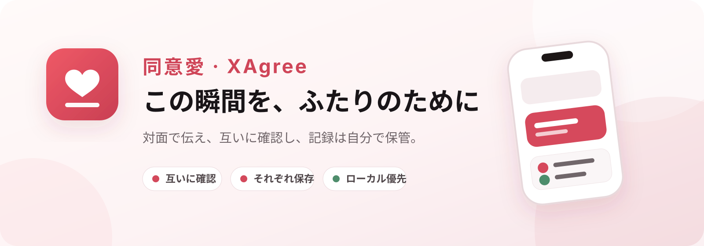
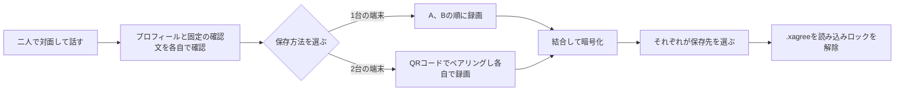

<p align="center">
  <a href="./README.md">简体中文</a> · <a href="./README_EN.md">English</a> · <strong>日本語</strong>
</p>

<p align="center">
  
</p>

<p align="center">
  
  
  
  
</p>

<p align="center">
  <strong>同意愛（XAgree）</strong>は、成人したパートナー同士の意思確認を記録するローカルファーストのアプリです。<br>
  アカウント、開発者サーバー、広告、トラッキングはありません。二人が対面で参加し、それぞれが自分の記録を保管します。
</p>

<p align="center">
  简体中文 · English · 日本語
</p>

> [!IMPORTANT]
> 同意は、意識が明瞭な状態で、自発的かつ明確に示され、継続的に確認され、いつでも撤回できるものでなければなりません。動画やファイルはその場でのコミュニケーションに代わるものではなく、永続的な同意、本人確認、法的な結論を示すものでもありません。本プロジェクトは、法定年齢に達し、自由に意思を表明でき、適法な目的で利用する参加者のみを対象としています。

## 製品概要

<table>
  <tr>
    <td align="center" width="29%">
      <br>
      <sub>簡体字中国語 · 2つの記録モード</sub>
    </td>
    <td align="center" width="29%">
      <br>
      <sub>English · UIを完全にローカライズ</sub>
    </td>
    <td align="center" width="42%">
      <br>
      <sub>iPad · 大画面に対応するレイアウト</sub>
    </td>
  </tr>
</table>

## XAgreeが目指すもの

XAgreeが重視するのは、証拠作成のプレッシャーを与えることではなく、二人で境界線を明確にすることです。各参加者は、自分でプロフィールを確認し、固定の確認文を読み、自分の録画を開始する必要があります。完成した内容は暗号化され、参加者が選んだ場所にのみ保存されます。

| 機能 | 体験 |
| --- | --- |
| **2台のスマートフォン、それぞれに保存** | QRコードで近くの端末同士を暗号化接続し、各自が録画・暗号化・保存します。 |
| **1台のスマートフォン、交代で録画** | 二人が順番に録画し、最終記録を A → B の順で結合します。 |
| **プライベートスペース** | ローカルパスワードでプロフィールと未書き出しデータを保護します。パスワードは開発者に送信されません。 |
| **暗号化ファイル** | バージョン管理された `.xagree` ファイルを書き出し、本アプリと対応するパスワードでのみ再生できます。 |
| **明確な録画状態** | 3秒のカウントダウン、目立つ `REC` 表示、最長30秒、ローカル時刻とセッション情報の焼き込みウォーターマーク。 |
| **多言語・マルチデバイス** | 簡体字中国語、英語、日本語、およびiPhoneとiPadに対応します。 |

## 利用の流れ



1. **プライベートスペースを作成**
   8文字以上のローカルパスワードを設定し、必要に応じてヒントを追加します。名前とアバターは、暗号化された端末内設定にのみ保存されます。

2. **記録モードを選択**
   1台の端末で交代して録画するか、近くの2台の端末を使って各自が録画・保存します。

3. **全員が自分で操作**
   各参加者が情報と確認文を確認し、自分で開始ボタンを押します。無音・バックグラウンド・遠隔で録画を開始する機能はありません。

4. **結合・暗号化・書き出し**
   2つの動画を決められた順序で結合し、暗号化された `.xagree` パッケージに格納して、システムの「ファイル」画面から書き出します。

5. **必要なときだけロックを解除**
   「ファイル」からパッケージを読み込み、パスワードを入力します。再生用の一時的な平文データは、再生終了、画面ロック、バックグラウンド移行、またはタイムアウト時に削除されます。

## プライバシー設計

- **アカウント不要：** 登録、ログイン、電話番号、メールアドレスの入力はありません。
- **開発者クラウドなし：** 開発者が運営するサーバーには接続しません。2台モードは近くの端末同士だけで通信します。
- **行動トラッキングなし：** 広告、分析、クラッシュレポートSDK、第三者の統計SDKは使用しません。
- **保存先は利用者が選択：** システムのファイルピッカーで書き出します。iCloud Driveを選んだ場合、ファイルは開発者ではなくApple iCloudに保存されます。
- **写真ライブラリに保存しない：** 元動画と結合後の平文動画を通常の動画として写真ライブラリに保存しません。
- **バックグラウンドで即時遮蔽：** アプリがバックグラウンドに移ると画面を隠し、再生用の一時平文をクリーンアップします。
- **必要最小限の権限：** カメラ、マイク、ローカルネットワークは、対応する機能を使用するときにのみ要求します。

同梱のPrivacy Manifestでは、収集データなし、トラッキングなし、トラッキングドメインなしと宣言しています。

## セキュリティ実装

| 項目 | 現在の実装 |
| --- | --- |
| パッケージ暗号化 | ランダムな256-bitコンテンツ鍵を生成し、動画を1 MiB単位でAES-256-GCM暗号化します。 |
| パスワード導出 | ファイルごとのランダムソルトと、端末上で調整した反復回数を用いるPBKDF2-HMAC-SHA512。 |
| 2台間の鍵共有 | 一時的なX25519（Curve25519 Key Agreement）+ HKDF。双方が比較する6桁の確認コードを表示します。 |
| 通信保護 | `MCSession`で暗号化を必須とし、動画セグメントもセッション鍵で分割暗号化します。 |
| 完全性検証 | AES-GCM認証タグ、nonce重複検査、SHA-256ファイルハッシュ。 |
| 端末内ファイル保護 | 作業ファイルに`NSFileProtectionComplete`を設定し、システムバックアップから除外します。 |

設計と実装には、今後も独立したレビューが必要です。現代的な暗号アルゴリズムを使用していることは、セキュリティ認証を取得済みであることを意味しません。

## 技術スタック

- **UIと状態管理：** SwiftUI、Observation
- **音声・動画：** AVFoundation、AVAssetWriter、AVMutableComposition
- **暗号：** CryptoKit、CommonCrypto、Security
- **近距離通信：** MultipeerConnectivity、Core Image QRコード
- **ファイルと画像：** UniformTypeIdentifiers、PhotosUI、システムファイルピッカー
- **プロジェクト：** Swift 6言語モード、iOS 17.0+、iPhone / iPad
- **サードパーティ依存関係：** なし

## ローカルビルド

### 必要環境

- macOS
- Xcode 26.6（現在の開発環境）
- Swift 6.3.3（プロジェクトはSwift 6言語モードを使用）
- iOS 17.0以降のシミュレータまたは実機

### 実行

```bash
git clone https://github.com/han-ziyi/agree.git
cd agree
open "性同意.xcodeproj"
```

Xcodeで`性同意` SchemeとiPhoneまたはiPadの実行先を選択し、実行してください。

コマンドラインでのビルド：

```bash
xcodebuild \
  -project "性同意.xcodeproj" \
  -scheme "性同意" \
  -sdk iphonesimulator \
  CODE_SIGNING_ALLOWED=NO \
  build
```

### テスト

暗号化のユニットテストと、主要な初期設定フローのUIテストが含まれています。

```bash
xcodebuild \
  -project "性同意.xcodeproj" \
  -scheme "性同意" \
  -destination "platform=iOS Simulator,name=iPhone 16 Pro" \
  test
```

## リポジトリ構成

```text
.
├── 性同意/                     # アプリのソースとリソース
│   ├── AppRootView.swift       # 初期設定、ホーム、プライバシーUI
│   ├── CaptureService.swift    # 録画と焼き込みウォーターマーク
│   ├── EvidenceCrypto.swift    # .xagreeパッケージの暗号化
│   ├── PeerSessionCoordinator.swift
│   └── Localizable.xcstrings   # 簡体字中国語 / 英語 / 日本語
├── XAgreeTests/                # ユニットテスト
├── XAgreeUITests/              # UIテスト
├── docs/assets/                # README用の製品画像
└── APP_PLAN.md                 # 製品・セキュリティ設計メモ
```

## 現在のステータス

現在はローカル開発および実機検証の段階で、正式なApp Store版としては未公開です。公開前に、以下が必要です。

- 実機2台を使ったエンドツーエンド検証
- 独立したセキュリティ・プライバシーレビュー
- 適用地域における法的レビュー
- App Store審査の事前評価

## 利用上の境界

- 本アプリは、本人確認、年齢確認、録画内容の真実性確認を行いません。
- 端末のローカル時刻によるウォーターマークは、信頼された法的タイムスタンプではありません。
- 記録は同意が継続していることを証明できず、その後の同意撤回を妨げるものでもありません。
- iOSのフラッシュストレージには検証可能な安全消去の保証がないため、「完全な物理削除」は約束しません。
- いずれかの参加者が迷っている、不快に感じている、圧力を受けている、明確に意思表示できない、または同意を撤回した場合は、直ちに中止してください。

---

<p align="center">
  <br>
  <strong>境界線を明確にし、記録は自分の手元に。</strong>
</p>
